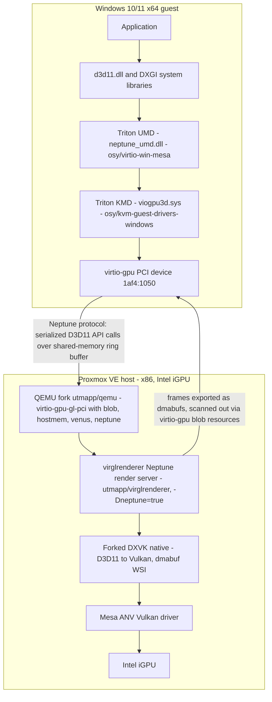

# Feasibility: Triton (Neptune D3D11) on Proxmox VE Windows guests

**Status:** research / pre-build
**Target:** Proxmox VE 8.x/9.x, x86_64 host, Intel iGPU (ANV Vulkan), Windows 10/11 x64 guest

## 1. Executive summary

Triton is the first working open-source DirectX 11 WDDM driver for QEMU virtio-gpu. The host side was **proven on Linux/KVM** (Ubuntu 24.04, `-accel kvm`) during the Neptune work, using a forked DXVK built as a native library with a headless dmabuf WSI — no display server required on the host. That is the configuration Proxmox needs. Nothing in the published architecture is macOS-specific on the Neptune/DXVK path; the macOS work (D3DMetal/DXMT backends, `-display cocoa,gl=es`) is layered on top of a Linux-capable base.

**Verdict: plausible but not turnkey.** Three areas carry real risk and must be validated in order:

1. Whether the forked QEMU (`utmapp/qemu`) builds and runs cleanly under Proxmox's generated argument set (machine versions, pflash/UEFI, existing PVE defaults).
2. Whether the virtio-gpu blob-resource scanout reaches the Proxmox noVNC/SPICE console on a headless host.
3. Whether the Intel iGPU + ANV stack on the PVE host satisfies the forked DXVK's Vulkan requirements (Vulkan 1.3+, dmabuf import/export).

## 2. Stack overview



Key architectural facts (from the Triton and Neptune posts):

- **Triton UMD is a DDI-to-API inverse transform.** Windows apps talk to `d3d11.dll`/`dxgi.dll`; the UMD implements the WDDM DDI by converting DDI calls *back* into D3D11 API calls, which Neptune serializes across the hypervisor boundary. No system DLLs are replaced, so anti-cheat systems are not tripped by construction.
- **The host deserializes D3D11 API calls directly** — no intermediate bytecode (unlike VirtualBox's SVGA3D approach) and no interpreter on the host. The Neptune render server in virglrenderer forwards them to DXVK.
- **Swapchain ownership moved guest-side.** The guest driver owns swapchain management; frames cross the boundary as dmabuf resources with import/export. On the Linux host, DXVK-native was rebuilt with a headless WSI that exports dmabufs (`-Dnative_dmabuf=true`) instead of rendering to a screen.
- **Presentation is virtio-gpu scanout**, not X11/Wayland, in the final architecture (the earlier Wine-era host-side swapchain/X11 DRI3 present path was removed). This is what makes a display-less hypervisor host viable.
- The KMD (`viogpu3d`) binds `PCI\VEN_1AF4&DEV_1050` and, via its INF, registers `neptune_umd.dll` as the D3D UMD and the Venus ICD (`vulkan_virtio.dll` + `virtio_icd.json`) as the Vulkan driver — so **Venus works alongside Neptune in the same guest** for Vulkan-only workloads.
- Measured present latency in the proven config: ~23 µs via virtio vs ~13 ms via vtest (579x), i.e. the virtio path is the one to use and its performance is competitive with Venus.

## 3. Host-side requirements on PVE

| Component | Source | Notes for Proxmox |
| --- | --- | --- |
| QEMU | `utmapp/qemu`, `utm-edition` branch | Configure picks up virglrenderer via pkg-config; must report `virglrenderer: YES`. UTM-only device `virtio-ramfb-gl` does not exist in vanilla QEMU. |
| virglrenderer | `utmapp/virglrenderer` | Built with `-Dneptune=true`; produces `virgl_render_server` (render-isolated worker processes per guest context). The Linux-relevant branch must be identified (see [next-steps.md](next-steps.md) — `macos-next` is the macOS branch). |
| DXVK | osy's fork | Native (non-Wine) build with dmabuf WSI. Loaded by the Neptune render server; needs a Vulkan 1.3 driver on the host. |
| Vulkan driver | Mesa ANV (stock) | PVE 8 = Debian 12 (Mesa 22.3, ANV exposes Vulkan 1.3 on Skylake+); PVE 9 = Debian 13 (Mesa 25.x). Gen9 (Skylake) or newer iGPU assumed. **Optional, vendor-agnostic:** the requirement is only "a Vulkan 1.3 ICD with dmabuf external memory" — `mesa-vulkan-drivers` ships as a `Recommends` of `pve-triton-virglrenderer`; an NVIDIA host can substitute the proprietary driver's ICD, keeping an NVIDIA-compatibility pathway open. |
| Kernel / i915 | stock PVE kernel | Only needs to support the iGPU with dmabuf export/import; no DKMS modules required (unlike SR-IOV approaches). |

Proven Linux-host precedent from the Neptune post: QEMU run on Ubuntu 24.04 with `-accel kvm -cpu host -smp 4 -m 16G`. Proxmox generates an equivalent (KVM-accelerated) argument set, so the hypervisor configuration itself is not exotic.

### QEMU device configuration

The UTM/Neptune-enabled device line (from the Triton post):

```
-device virtio-gpu-gl-pci,hostmem=8G,blob=true,venus=true,neptune=true
```

- `neptune=true` advertises the Neptune capset to the guest; `venus=true` additionally advertises Venus (guest Vulkan).
- `blob=true` plus a `hostmem` window is **required** (this is how cross-boundary shared resources/dmabufs are backed).
- The 4 KiB `ipa-granule-size` requirement in the Triton post is HVF-specific (macOS). Under KVM this flag does not apply, but equivalent hostmem alignment constraints should be verified.
- Vanilla-QEMU bootstrapping sequence per the Triton post: boot with `ramfb` (POST display before drivers exist), install guest drivers, then switch to `virtio-gpu-gl-pci` and reboot. On Proxmox this maps to: `vga: std` (or default) during install → install driver → set `vga: none` and attach the virtio-gpu device via `args:` → reboot.

## 4. Proxmox integration points

- **Attaching the device:** PVE does not expose `neptune=true` or blob virtio-gpu natively. Use the VM's `args:` option (raw QEMU args appended to the generated command line) with `vga: none` so PVE does not add a conflicting display device:
  ```
  # /etc/pve/qemu-server/<vmid>.conf
  vga: none
  args: -device virtio-gpu-gl-pci,hostmem=4G,blob=true,venus=true,neptune=true
  ```
- **Running the forked QEMU:** PVE hardcodes its packaged `qemu-system-x86_64`. Per project convention, all host-side components are built into Debian packages (`pve-triton-dxvk`, `pve-triton-virglrenderer`, `pve-triton-qemu` — see the packaging strategy in [porting.md](porting.md#1-packaging-strategy)) and served from a local APT repo, with a `/usr/bin/pve-triton-qemu` wrapper handling `LD_LIBRARY_PATH`. The packages coexist with `pve-qemu-kvm` (no Conflicts/Replaces) so PVE updates keep working; per-VM dispatch goes through the wrapper. Note: **no DKMS package is applicable** — the stack has no out-of-tree host kernel modules (i915 is in-tree; ANV/DXVK are userspace), and the Windows driver is a guest-side WDDM install.
- **Machine compatibility:** PVE pins `machine: pc-q35-X.Y` per VM. The QEMU fork must contain PVE's machine types — i.e. the fork's QEMU base version must be equal to or newer than PVE's packaged QEMU (PVE 8.4 ships QEMU 9.2, PVE 9.x ships newer). This is a build-time check, not a runtime hack.
- **Console/display:** default noVNC connects to QEMU's VNC server. Whether virtio-gpu **blob** scanout surfaces on that VNC server is the top open display question (see risk R1). Fallbacks: SPICE (has a dmabuf-friendly path), or QEMU `egl-headless` to give VNC a GL surface.
- **Memory accounting:** the `hostmem` window is reserved in addition to guest RAM (`-m`). A VM with 8G RAM + `hostmem=4G` costs ~12G of host RAM. Size accordingly.

## 5. Guest driver install (Windows 10/11 x64)

1. Create the VM with default display (`vga: std`), q35, UEFI (OVMF), virtio disk/net from the standard `virtio-win` ISO, Windows guest tools as usual.
2. Obtain the signed pre-release driver package from the `osy/kvm-guest-drivers-windows` GitHub releases (labeled pre-release; stability warning attached). The package contains `viogpu3d.sys`, `viogpu3d.inf`, `viogpu3d.cat`, `neptune_umd.dll`, `vulkan_virtio.dll`, `virtio_icd.json` (plus WOW64/ARM64X view DLLs as applicable — x64 builds may include `neptune_umd_x86.dll` for WOW64).
3. Install: `pnputil /add-driver viogpu3d.inf /install` (or Device Manager → Update driver against the `1AF4:1050` PCI device while still on `vga: std` — verify the device is visible).
4. Reboot, switch the VM to the Neptune virtio-gpu device (`vga: none` + `args:` line), reboot again.
5. Validate in-guest: Device Manager shows a GPU from the Triton stack; `dxdiag` reports D3D11 feature levels via the Neptune UMD; `vulkaninfo` sees the Venus ICD.

## 6. Risk register

| # | Risk | Severity | Detail / mitigation |
| --- | --- | --- | --- |
| R1 | **Display/scanout path to the PVE console** | High | Blob-resource scanout may not reach the stock noVNC VNC backend. Mitigation: test SPICE first (dmabuf-friendly), then `egl-headless` + VNC; worst case, patch QEMU's VNC backend (would be the first real fork-maintenance item). |
| R2 | **QEMU fork vs PVE argument set** | High | PVE generates a long, versioned QEMU command line (machine `pc-q35-X.Y`, pflash/UEFI, virtio peripherals, `vga: none` handling). The fork must accept all of it. Mitigation: diff PVE's generated cmdline (`qm showcmd <vmid> --show-opts`) against the fork's supported options before any VM work; keep the fork's base version >= PVE's QEMU. |
| R3 | **virglrenderer branch provenance for Linux** | High | `macos-next` is the macOS integration branch. The Linux Neptune + DXVK path lives in the same project but the correct Linux-targeted branch/tag must be identified (it is the branch the Neptune post's build instructions describe). See [next-steps.md](next-steps.md). |
| R4 | **Intel iGPU / ANV capability** | Medium | DXVK 2.x needs Vulkan 1.3; ANV provides it on Gen9+ with Mesa 22.3+ (PVE 8) — but the forked DXVK additionally requires dmabuf *import and export* through the Vulkan driver (VK_EXT_external_memory_dma_buf) and cross-context sharing. Skylake/Gen9 is the oldest realistic target; Gen11+ (Ice Lake onward) is safer. Verify with `vulkaninfo` + a minimal dmabuf smoke test before the full stack. |
| R5 | **hostmem memory pressure** | Medium | The blob hostmem window is reserved on top of guest RAM. On iGPU hosts this also shares system RAM with the GPU. Keep the window small for a first bring-up (e.g. 2–4G) and confirm PVE's memory/swap accounting behaves. |
| R6 | **Pre-release maturity** | Medium | The Windows driver packages are signed pre-releases with an explicit stability warning; the whole stack is a research project by one developer. Expect crashes, treat the VM as disposable, use `-snapshot`-style testing where possible (PVE: test VMs on throwaway storage / backups). |
| R7 | **Maintenance burden** | Medium | Four forked repos (`utmapp/qemu`, `utmapp/virglrenderer`, DXVK fork, `kvm-guest-drivers-windows`) must track upstream PVE updates. Each PVE kernel/QEMU/Mesa update can invalidate assumptions. Budget a rebuild-repackage-retest cycle per PVE point release (the `+pve` versioned .debs and `apt-mark hold` make this auditable). |
| R8 | **Per-title game compatibility** | Low (for lab use) | D3D11 feature coverage is bounded by the DDI→API transform and DXVK; some titles may fail on unimplemented DDI prototypes. This is inherent to the approach, not a Proxmox integration issue. D3D12/VKD3D is not supported yet (on the roadmap). |
| R9 | **Licensing of combined distribution** | Low | QEMU (GPLv2), virglrenderer (MIT), Mesa (MIT), DXVK (Zlib/LGPL mix), Windows drivers (GPL-adjacent WDDM stack). Building/hosting binaries for personal use is fine; public distribution needs a license review per component. |

## 7. Phased validation plan

**Phase 0 — Host inventory (no builds).**
On the PVE host: record PVE version, packaged QEMU version (`qemu-system-x86_64 --version`), iGPU model (`lspci -nn | grep -i vga`), kernel version, Mesa/ANV version (`vulkaninfo --summary`), confirm VK_EXT_external_memory_dma_buf and Vulkan 1.3. Record `qm showcmd <test-vmid> --show-opts` for an existing Windows VM to capture the exact argument set the fork must accept.

**Phase 1 — Build and package the forks (containerized).**
Build `utmapp/qemu` + `utmapp/virglrenderer` (Linux branch) + forked DXVK (`-Dnative_dmabuf=true`) in a Debian container matching the PVE release's toolchain, producing the `pve-triton-*` .deb packages (packaging strategy in [porting.md](porting.md#1-packaging-strategy)). Exit criteria: all three .debs build, QEMU reports `virglrenderer: YES` at configure, `virtio-gpu-gl-pci` accepts `blob=true,hostmem=...,venus=true,neptune=true`, `virgl_render_server` launches, and the installed fork starts a stock PVE-generated Windows VM config identically to packaged QEMU (compare with `-dump-vmstatedesc`-level diligence or simply boot + interact).

**Phase 2 — Neptune smoke test with a Linux guest (proven configuration).**
Boot a Linux guest under the fork with the Neptune device; run a D3D11 workload through Wine/Proton *in the guest* against the Neptune backend (the configuration validated in the Neptune post). Exit criteria: frames render and scan out to the PVE console (this phase also answers risk R1 for the Windows case, since scanout is identical), and `virgl_render_server` workers appear with DXVK loaded.

**Phase 3 — Windows guest bring-up.**
Install the signed Triton driver package per section 5, switch the VM to the Neptune virtio-gpu device, validate DWM composition on the desktop (the acid test: smooth compositing proves shared-texture/fence paths work), then run 3DMark Fire Strike and a small D3D11 game. Exit criteria: stable desktop, benchmark completes, no host-side crashes across a week of use.

## 8. What success looks like

A Windows 11 VM on Proxmox whose Device Manager shows the Triton GPU, whose DWM composites on it, and which runs 3DMark — all rendered by the host iGPU via ANV, with the VM manageable through normal PVE tooling (start/stop/backup) using only a `vga: none` + `args:` config change and a forked QEMU on the host.
