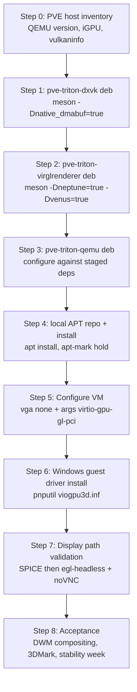

# Porting map: Triton/Neptune stack to Proxmox VE

Companion to [feasibility.md](feasibility.md). This maps the concrete steps to go from "UTM's Triton stack, released for macOS hosts" to "Triton D3D11 acceleration in a Proxmox VE Windows guest on an x86 host with an Intel iGPU".

## 0. What actually needs porting

Less code than it sounds. Neptune was **brought up on a Linux host first** (Ubuntu 24.04, KVM, forked DXVK as the host renderer), and the Triton post ships the Linux build recipes in its appendix. The macOS release added macOS-specific backends (D3DMetal/DXMT, ANGLE-on-Metal, `-display cocoa,gl=es`) on top of a Linux-capable base. So this is primarily a **build-and-integration port**, not a code port — and per project convention, **every host-side component is packaged as a Debian package** rather than installed from a loose prefix:

| Component | Port status for PVE | Deliverable (.deb) | Work involved |
| --- | --- | --- | --- |
| Guest UMD (`neptune_umd.dll`, `osy/virtio-win-mesa`) | **None** | none (Windows guest driver) | Prebuilt, signed, ships in the driver package (MSYS2-built on Windows). Not built on PVE. |
| Guest KMD (`viogpu3d.sys`, `osy/kvm-guest-drivers-windows`) | **None** | none (Windows guest driver) | Same — signed pre-release package. |
| DXVK fork | **Rebuild** | `pve-triton-dxvk` | Native Linux build with dmabuf WSI; recipe published. No code changes expected. |
| virglrenderer (`utmapp/virglrenderer`) | **Rebuild + branch pick** | `pve-triton-virglrenderer` (Depends: dxvk) | `-Dneptune=true -Dvenus=true` Linux build; must confirm the correct branch for the Linux/DXVK backend (Q1 in [next-steps.md](next-steps.md)). |
| QEMU (`utmapp/qemu`, `utm-edition`) | **Rebuild + PVE compat** | `pve-triton-qemu` | Linux build is trivial; the work is base-version/machine-type compatibility with PVE's generated command line (Q2/Q3). |
| macOS-only components | **Skip** | — | WebKit/ANGLE/libepoxy, d3dmetal-native, dxmt-native, universal `lipo` render server, HVF `ipa-granule-size` — none apply to a Linux host. |
| Integration glue | **New** | `pve-triton-stack` (meta) + wrapper/conffiles | Packaging rules, VM config, environment plumbing (LD_LIBRARY_PATH via package-provided env file), console/display validation. This is the genuinely new work. |

### DKMS applicability (read before assuming it's needed)

**DKMS is not applicable to this stack, and that is a feature, not a gap.** The PVE host needs no out-of-tree kernel modules: the Intel iGPU runs on the in-tree `i915` driver, Vulkan access is userspace (Mesa ANV), and all forked components (QEMU, virglrenderer, DXVK) are pure userspace. DKMS exists for out-of-tree kernel modules (the pattern used by, e.g., vendor GPU drivers on Proxmox); there is no such module here. The Windows-side `viogpu3d.sys` is a guest WDDM driver installed via `pnputil` inside the VM — unrelated to DKMS by definition.

**Commitment:** if a future change ever requires a kernel module (e.g. a custom dmabuf exporter), it must be built via `pve-triton-dkms` following the standard DKMS package layout (`usr/src/<module>-<version>/` + `dkms.conf` + `postinst` calling `dkms install`). Until then, no DKMS package is created.

## 1. Packaging strategy

- **Tooling:** `debhelper` + `meson` build-deps (i.e. `dh` with the meson buildsystem); each component is one source package with a matching binary package name from the table above.
- **Filesystem layout (FHS-clean, dpkg-owned):** binaries in `/usr/lib/pve-triton/{qemu,virglrenderer,dxvk}/`, shared env file in `/etc/pve-triton/env` (exporting `LD_LIBRARY_PATH=/usr/lib/pve-triton/{virglrenderer,dxvk}/lib`), wrapper at `/usr/bin/pve-triton-qemu` (sourcing the env file, then `exec`ing the real binary). No `/opt`, no loose files outside dpkg's database.
- **Versioning:** `<upstream-version>+pve<triton-serial>` (e.g. `9.2.0+pve1`), tracking the base QEMU version so compatibility with PVE's machine types is legible from `dpkg -l`.
- **Coexistence:** `pve-triton-qemu` must **not** `Breaks:`/`Replaces:` `pve-qemu-kvm` — the packages coexist; the wrapper dispatches. If a VM is later switched fully to the fork, do it via the wrapper, not by conflicting with the packaged QEMU (so PVE updates keep working).
- **Distribution:** build in a Debian container matching the PVE release, publish to a local APT repo (e.g. `reprepro`/`aptly` served on the PVE host or LAN), then `apt install` + `apt-mark hold pve-triton-*` to survive unattended upgrades. This replaces any manual binary-copy or wrapper-shadowing step.
- **Conffiles:** the wrapper, env file, and example VM config snippet ship as conffiles so local edits survive upgrades.

## 1. Build-order dependency graph



Each step below states the goal, the concrete actions, and the pass criteria. Steps 1–3 each end with a `dpkg-buildpackage` run inside the same Debian container; the .deb artifacts accumulate in the local APT repo installed in Step 4.

## Step 0 — PVE host inventory

Goal: confirm the host can support the Vulkan/dmabuf path before any build time is spent.

```bash
pveversion                                  # record PVE version (8.x / 9.x)
qemu-system-x86_64 --version                # packaged QEMU version; fork must be >= this
lspci -nn | grep -i vga                     # iGPU model (want Gen9/Skylake or newer)
vulkaninfo --summary                        # ANV driver, Vulkan 1.3, device UUID
vulkaninfo | grep -i dma_buf                # VK_EXT_external_memory_dma_buf present?
qm showcmd <test-vmid> --show-opts          # full PVE-generated arg set the fork must accept
```

Pass: ANV reports Vulkan 1.3 + dma_buf ext; save the `qm showcmd` output — it is the compatibility contract for Step 3.

## Step 1 — Package the forked DXVK (host renderer)

Goal: native (non-Wine) DXVK whose WSI exports frames as dmabufs, shipped as the `pve-triton-dxvk` .deb. Upstream recipe from the Neptune post appendix, wrapped in Debian packaging:

```bash
git clone https://github.com/osy/dxvk.git $SRC/dxvk   # branch: master (recon Q7: RESOLVED)
cd $SRC/dxvk
# debian/ uses dh with the meson buildsystem; meson flags via debian/rules override:
#   -Dnative_headless=true -Dnative_sdl2=disabled -Dnative_sdl3=disabled
#   -Dnative_glfw=disabled -Dbuildtype=release -Db_ndebug=true
#   -Dprefix=/usr/lib/pve-triton/dxvk
dpkg-buildpackage -us -uc
```

Notes for the PVE context:
- **Build-recipe correction:** the Neptune post's `-Dnative_dmabuf=true` no longer exists in the current fork — it was replaced by `-Dnative_headless=true` ("headless (no-window) WSI carrier for DXVK Native").
- Outputs are the host backend libraries the Neptune render server `dlopen`s: **`libd3d11.so`** and **`libdxgi.so`** (plus `libvkd3d-proton-d3d12.so` later if D3D12 is wanted). At runtime their locations are overridable via `NPT_D3D11_LIBRARY_PATH` / `NPT_DXGI_LIBRARY_PATH` / `NPT_D3D12_LIBRARY_PATH` — the package's env file can set these explicitly instead of relying on defaults.
- Build in a Debian container matching the PVE release's userspace (Debian 12 for PVE 8, Debian 13 for PVE 9) to avoid glibc/mesa skew; the .deb is built in this container, never on the PVE host.
- No SDL/GLFW needed — the headless WSI needs no window system; no X11/Wayland dev packages required, which keeps the package's dependency set tiny. Good for a headless hypervisor.
- Do *not* register these libraries system-wide (no ldconfig links into `/usr/lib/x86_64-linux-gnu`): they are private to the render server, hence the `/usr/lib/pve-triton/dxvk` prefix.

Pass: `pve-triton-dxvk_<version>.deb` builds; `dpkg -c` shows only the DXVK shared libraries under `/usr/lib/pve-triton/dxvk`; `dpkg -I` shows no runtime deps beyond libc/libstdc++.

> **Verified 2026-10-07 (LXC, Debian 13.1):** plain build succeeds (`ninja`, 337 targets, ~4 min at `-j4`). Two recipe notes: (1) the repo's `include/vulkan` is a **pinned Vulkan-Headers submodule** — run `git submodule update --init --recursive` *before* the first meson setup, and if setup already failed, wipe the build dir and re-run so `-I include/vulkan/include` enters the compile lines (the fork pins Vulkan-Docs 1.4.340; Debian's system headers are too old). (2) The installed lib names are **`libdxvk_d3d11.so` / `libdxvk_dxgi.so`** (under `lib/x86_64-linux-gnu/`) — not `libd3d11.so`/`libdxgi.so`. The render server's `NPT_D3D11_LIBRARY_PATH`/`NPT_DXGI_LIBRARY_PATH` env vars must point at the `libdxvk_*` names. The `.pc` files ship as `dxvk-d3d11.pc`, `dxvk-dxgi.pc`, etc.

## Step 2 — Package virglrenderer with Neptune

Goal: the host component that deserializes Neptune D3D11 calls and drives DXVK, shipped as `pve-triton-virglrenderer` (Depends: `pve-triton-dxvk`). Upstream recipe, unchanged for Linux:

```bash
# branch dev/neptune-linux (recon Q1: RESOLVED — the Linux Neptune branch;
# meson options -Dneptune=true and -Dvenus=true exist in meson_options.txt)
git clone -b dev/neptune-linux https://github.com/utmapp/virglrenderer.git $SRC/virglrenderer
cd $SRC/virglrenderer
# debian/rules meson flags:
#   -Dneptune=true -Dvenus=true -Dtests=false
#   -Dprefix=/usr/lib/pve-triton/virglrenderer
#   (pkg-config finds dxvk via the staged pve-triton-dxvk build or a .pc in the same prefix)
dpkg-buildpackage -us -uc
```

Port-specific differences from the macOS build:
- **No render-server fusion.** The macOS flow builds an x86_64 slice for D3DMetal and `lipo`s it with an arm64 DXMT slice. On Linux there is one native render server (`virgl_render_server`) linking/finding the DXVK libs.
- **Environment discovery is `LD_LIBRARY_PATH`, not `DYLD_FALLBACK_LIBRARY_PATH`**: the render server `dlopen`s the DXVK libraries by plain name, so `/usr/lib/pve-triton/dxvk/lib` must be on `LD_LIBRARY_PATH` at runtime (supplied by the package's env file, Step 4).
- `-Dneptune=true` selects the Neptune backend over Venus inside the server; keep `-Dvenus=true` so the same server also serves guest Vulkan (the Triton KMD registers the Venus ICD too).

Pass: `pve-triton-virglrenderer_<version>.deb` builds and installs; on the PVE host, with the DXVK libs resolving via `NPT_*_LIBRARY_PATH`, `/usr/lib/pve-triton/virglrenderer/libexec/virgl_render_server` starts.

> **Verified 2026-10-07 (LXC, Debian 13.1):** one build fix needed — `src/vrend/vrend_renderer.c` fails under `-Werror=pedantic` (label followed by declaration, GCC 14 strictness). Worked around with `-Dc_args=-Wno-error=pedantic -Dcpp_args=-Wno-error=pedantic`; ship this as a `debian/patches/0001-...` entry rather than editing upstream code. Also: DXVK is a **build-time pkg-config dependency** (`Requires.private: ... dxvk-dxgi` in `virglrenderer.pc`) — the build environment needs `PKG_CONFIG_PATH` to include *both* the virglrenderer and dxvk staging prefixes. Install layout: `libexec/virgl_render_server`, `lib/x86_64-linux-gnu/libvirglrenderer.so.1`, `bin/virgl_test_server`.

## Step 3 — Package the QEMU fork

Goal: `utmapp/qemu` (`utm-edition` branch) built on Debian with virglrenderer found via pkg-config, accepting PVE's argument set, shipped as `pve-triton-qemu`.

```bash
# branch dev/neptune-linux (recon Q2/Q3: RESOLVED — base QEMU 10.0.12, neptune
# device property in hw/display/virtio-gpu-gl.c; machine types cover pc-q35 up
# to 10.0, i.e. PVE 8.x (9.2) and PVE 9.x (10.x) guests)
git clone -b dev/neptune-linux https://github.com/utmapp/qemu.git $SRC/qemu
cd $SRC/qemu
# debian/rules configure flags (verified recipe — see note below):
#   PKG_CONFIG_PATH=<virglrenderer-staging>/pkgconfig:<dxvk-staging>/pkgconfig
#   --prefix=/usr/lib/pve-triton/qemu
#   --disable-werror --disable-docs --enable-plugins
#   --target-list=x86_64-softmmu   (trimmed for the PVE use case)
dpkg-buildpackage -us -uc
```

> **Verified 2026-10-07 (LXC, Debian 13.1):** configure passes with `KVM support: YES` and `VirGL support: YES 1.3.0`. Three gotchas: (1) `PKG_CONFIG_PATH` must chain **both** staging prefixes — virglrenderer's `.pc` carries `Requires.private: ... dxvk-dxgi`, so pkg-config needs the dxvk `.pc` files too, otherwise configure silently reports `VirGL support: NO`; (2) install **`libepoxy-dev` + `libgbm-dev` before configure** — without them, `OpenGL support (epoxy): NO` and `egl-headless` is not compiled in (configure summary text is the way to verify; QEMU 10 has no `config-host.mak` VIRGL lines); (3) full build is 2839 targets, ~10 min at `-j4` on 6 vCPU / 4 GiB RAM, no OOM.

PVE-compatibility checks (the real porting work in this step; do them against the installed package binary before the .deb is declared done):
1. Configure summary must report `virglrenderer: YES`.
2. `qemu-system-x86_64 -device virtio-gpu-gl-pci,help` must list `blob`, `hostmem`, `venus`, `neptune` properties.
3. Machine types: run `qemu-system-x86_64 -machine help | grep q35` and confirm `pc-q35-<PVE version>` exists (Q2).
4. Dry-run the saved PVE `qm showcmd` output against the fork binary (substitute the binary path, fix `-name`/pidfile paths) until it starts without argument errors.

Pass: the installed fork boots the stock PVE-generated Windows VM config (with `vga: std`, before the display switch) and is interactive in the same way as packaged QEMU.

## Step 4 — Local APT repo and host install

Goal: make the fork a first-class, dpkg-managed citizen on the PVE host — installable, upgradable, removable — without touching the packaged `pve-qemu-kvm`.

1. Collect the three .debs from Steps 1–3 into a local APT repo on the PVE host (or LAN host): `aptly` or plain `reprepro` over a small HTTP server; add it as an apt source with the signing key.
2. Install in dependency order: `apt install pve-triton-dxvk pve-triton-virglrenderer pve-triton-qemu pve-triton-stack` (the meta package pulls the other three plus the conffiles).
3. The packages provide the runtime plumbing — no manual env vars:
   - `/etc/pve-triton/env` (conffile): `LD_LIBRARY_PATH=/usr/lib/pve-triton/virglrenderer/lib:/usr/lib/pve-triton/dxvk/lib`
   - `/usr/bin/pve-triton-qemu` (wrapper): sources the env file and `exec`s `/usr/lib/pve-triton/qemu/bin/qemu-system-x86_64 "$@"`
4. Hold against unattended upgrades: `apt-mark hold pve-triton-dxvk pve-triton-virglrenderer pve-triton-qemu`; lift the hold only when a rebuild against new PVE packages has passed the Step 3 dry-run.
5. Sanity: `dpkg -L pve-triton-qemu` shows no files outside `/usr/lib/pve-triton`, `/usr/bin/pve-triton-qemu`, and `/etc/pve-triton`; run the Step 3 dry-run using the wrapper binary from the host.

Pass: `apt remove pve-triton-*` cleanly reverts the host to stock PVE; the wrapper boots a test VM launched exactly as PVE would.

> **DKMS note:** no step in this map produces a kernel module, so there is no DKMS package — see the applicability note in section 0. Add a `pve-triton-dkms` binary package only if the fork ever grows an out-of-tree module.

> **Verified 2026-10-07 (Debian 13 LXC build host):** all four packages build and install via `packaging/build-all.sh`:
>
> | package | version | size | notes |
> |---|---|---|---|
> | `pve-triton-dxvk` | 2.7.1 | 95M | 337 meson targets, `native_headless` |
> | `pve-triton-virglrenderer` | 1.3.0 | 862K | `neptune=true venus=true`, needs `-Wno-error=pedantic` on GCC 14 |
> | `pve-triton-qemu` | 10.0.12 | 49M | `x86_64-softmmu` only, linked against both staged pkgconfig dirs |
> | `pve-triton-stack` | 0.1 | 2.1K | meta; wrapper + `/etc/pve-triton/env` conffile |
>
> End-to-end check through the installed wrapper (`/usr/bin/pve-triton-qemu`) realizes the Neptune device (TCG smoke test, same as the Step 5 note below). Two packaging gotchas for rebuilds: build with `DEB_BUILD_OPTIONS=noautodbgsym nostrip`, and make the QEMU `debian/rules` `dh_auto_clean` a no-op (the source-root `Makefile` is a configure bootstrap; `make distclean` fails). On the PVE host, replace step 1's repo tooling with `apt install ./pve-triton-*.deb` if a LAN repo is overkill.

> **Verified 2026-10-07 (PVE 9.2.2 test node, i5-8500T, iGPU PCI-passthrough at 01:00.0):** all four packages installed via `apt install ./pve-triton-*.deb` (all four paths must be passed on one command line — a lone `./pve-triton-stack.deb` cannot resolve its component Depends). Post-install checks: stock `pve-qemu-kvm` 11.0.0 binary checksum unchanged, `qm` functional, and the fork realizes the Neptune device through the wrapper with `-accel kvm`. Two host findings:
>
> 1. `/dev/udmabuf` already exists — `CONFIG_UDMABUF` is built into the PVE 9.x kernel (`7.0.2-6-pve`), so the Step 5 `modprobe udmabuf` checklist item is a no-op there.
> 2. **The fork dlopens `libEGL.so.1`/`libGL.so.1` at runtime (via epoxy), which `dh_shlibdeps` cannot see** — `pve-triton-qemu` now carries explicit `Depends: libegl1, libepoxy0, libgbm1, libgl1, libopengl0`. If installing an older build by hand: `apt install libegl1 libepoxy0 libgbm1 libgl1 libopengl0` first (the fresh test node also needed `apt update` — Debian/PVE sources present but unpopulated).
>
> Packages held against unattended upgrades (`apt-mark hold pve-triton-*`).

> **Vulkan host driver (same date):** the render server's DXVK libraries target a host Vulkan ICD — on Intel/AMD hosts that is `mesa-vulkan-drivers` (ANV/RADV); it ships as a `Recommends` of `pve-triton-virglrenderer`, not a hard `Depends`, so an NVIDIA host can substitute the proprietary driver's ICD (keep this pathway open for future NVIDIA GPUs). Verified on the test node with `vulkaninfo --summary`: `Intel(R) UHD Graphics 630 (CFL GT2)`, `PHYSICAL_DEVICE_TYPE_INTEGRATED_GPU`, Vulkan 1.4.305 (`vulkan-tools` is useful for this check but not a runtime dep).

## Step 5 — VM configuration

Goal: attach the Neptune-capable virtio-gpu device to a Windows VM.

1. Provision the Windows 10/11 x64 VM normally (q35, OVMF, virtio disk/net from the `virtio-win` ISO, guest agent) with the **default display** (`vga: std`) — the guest needs a POST display before drivers exist; `virtio-ramfb-gl` is UTM-only.
2. After the OS and drivers are in place, switch:
   ```
   # /etc/pve/qemu-server/<vmid>.conf
   vga: none
   args: -device virtio-gpu-gl-pci,hostmem=4G,blob=true,venus=true,neptune=true
   ```
   Start small on `hostmem` (2–4G); it is reserved on top of `-m` (R5 in the risk register).
3. Boot and confirm in the guest: a `1AF4:1050` PCI device appears (Device Manager / `pnputil /enum-devices`).

Pass: device enumerated in the guest; VM still boots to desktop on the fallback display path (or headless, pending Step 7).

> **Machine-type gotcha (test node, 2026-10-07):** `qm showcmd 101` on PVE 9.2 resolves even a plain `machine: q35` pin to `-machine 'type=pc-q35-11.0+pve0'` — the stock QEMU 11.0 version plus PVE's machine-type patch. The utmapp fork (base 10.0.12, no PVE patches) accepts neither, so **`qm start` against the fork will fail at machine type** (risk R2 made concrete). Resolution options, in order of preference: pin the VM to `machine: pc-q35-10.0` and pass `args:` so the fork only needs the version-alias (verify the fork maps `pc-q35-10.0` — stock QEMU aliases minor versions), or launch the VM via the fork with a hand-built machine line (loses `qm` lifecycle integration; acceptable for a dedicated test VM). Saved contract: `/root/vm101-showcmd.txt` on the test node.

> **Resolved on the test node — the `/usr/bin/kvm` dispatcher shim (2026-10-07):** `qm start` under the fork works with full PVE lifecycle integration (QMP, pidfile, noVNC) via a `dpkg-divert` shim: the stock binary is preserved as `/usr/bin/kvm.distrib`, and `/usr/bin/kvm` (see `packaging/pve-triton-stack/kvm-dispatcher.sh`) routes only VMIDs listed in `PVE_TRITON_VMS` to the fork, rewriting the PVE-only bits the fork can't accept:
>
> | PVE emission | fork gap | shim rewrite |
> |---|---|---|
> | `type=pc-q35-<ver>+pve0` | no PVE machine patches | `pc-q35-10.0` |
> | `-id <vmid>` | pve-qemu-kvm-only option | stripped |
> | `-iscsi initiator-name=…` | no libiscsi in build | stripped |
> | `-cpu host,-cet-ibt,-cet-ss,…` | no CET props in QEMU 10 host model | `-cet-*` removed |
> | `-vnc …,password=on` | no DES cipher backend | `password=on` removed |
> | `"aio":"io_uring"` | no liburing in build | `"aio":"threads"` |
> | *(no `-accel` arg)* | pve-qemu-kvm defaults to KVM when named `kvm`; fork defaults to TCG | append `-accel kvm` |
>
> The last three go away once the fork is rebuilt with `liburing-dev`, `libiscsi-dev`, `libgcrypt20-dev` (Build-Depends updated). Note PVE pins a Windows guest's machine version to at least its `creation-qemu` meta value — the test VM's meta was lowered to `creation-qemu=10.0.0` so a `pc-q35-10.0` pin sticks. GL requirement: the Neptune device only realizes on a GL display backend — keep `vga: std` and add `-display egl-headless,gl=on` via `args:` (PVE's noVNC stays on the VGA console; egl-headless serves the virtio-gpu console).

> **Verified 2026-10-07 (LXC, no KVM):** with `-display egl-headless -S -device virtio-gpu-gl-pci,hostmem=256M,blob=true,venus=true,neptune=true`, the device **realizes successfully** through the built virglrenderer (TCG accel; the smoke test ran until killed). One new host requirement surfaced: QEMU logs `warning: open /dev/udmabuf: No such file or directory` — the fork uses the kernel's `udmabuf` helper (`CONFIG_UDMABUF`). It is non-fatal at device-realize time, but **add to the PVE host checklist: `modprobe udmabuf`** (and make it persistent via `/etc/modules-load.d/`); if QEMU runs inside an LXC, the node must also be passed into the container. Runtime impact (fatal vs fallback path) is still unverified — resolve on the PVE node.

## Step 6 — Windows guest driver install

Goal: Triton UMD/KMD bound to the virtio-gpu device.

1. Download the signed pre-release driver package from the `osy/kvm-guest-drivers-windows` GitHub releases; pick the **x64** asset (Q5).
2. Install inside the guest: `pnputil /add-driver viogpu3d.inf /install` (or Device Manager → Update driver on the `1AF4:1050` device).
3. Reboot. The INF registers `neptune_umd.dll` as the D3D UMD and `vulkan_virtio.dll` + `virtio_icd.json` as the Venus ICD — verify both: `dxdiag` should name the Triton/Neptune adapter for D3D11, and `vulkaninfo` should list the Venus ICD.
4. Take a VM snapshot before proceeding — WDDM rollbacks are unreliable, and this is the rescue point (R6).

Pass: `dxdiag` shows D3D11 via the Neptune adapter with no "Microsoft Basic Display Adapter" fallback; no Code 43.

## Step 7 — Display path validation (the highest-risk item)

Goal: prove the scanout path from virtio-gpu blob resources to something a human can watch (R1). Do this in order:

1. **SPICE**: set `display: spice` + `vga: none` in the VM config; connect with the SPICE client. SPICE has the most mature dmabuf/gl path in QEMU.
2. **egl-headless + noVNC**: if SPICE fails, add `args: -display egl-headless,...` (keeping PVE's VNC) so QEMU's VNC backend gets a GL surface for blob scanout.
3. **Fallback**: if neither renders, the QEMU VNC/SPICE backends need a small patch to surface blob scanout — that becomes the first real code change of the port (scope it then; ship it as a commit in the fork's packaging tree, released in the next `pve-triton-qemu` package bump).

Pass: smooth desktop in the guest console. A *smoothly compositing desktop* (DWM) is itself evidence the shared-texture/fence paths work, since DWM renders every frame through the Neptune stack.

## Step 8 — Acceptance

1. 3DMark Fire Strike completes; score recorded (Neptune post benchmarks are the reference point: Neptune host-side DXVK ≈ Venus performance).
2. One light D3D11 game or demo runs stable for 30+ minutes.
3. `virgl_render_server` worker processes observed on the host with DXVK loaded (one per guest render context); no host memory growth over days.
4. Normal PVE lifecycle works on the VM: `qm stop`/`start`, snapshot, backup, and cross-node migration — migration is supported once the second node also has the local APT repo and `pve-triton-*` packages installed at the same version (the `+pve` version suffix makes the requirement auditable via `dpkg -l`); until then, keep migration off.
5. Leave it running a week before declaring the port viable.

## Where the port could stall, in order

1. **Step 2** — wrong virglrenderer branch (macOS-only backend); resolve Q1 first.
2. **Step 3** — QEMU fork too old for PVE machine types or missing `neptune` property; resolve Q2/Q3 first.
3. **Step 7** — display scanout needs a QEMU patch; this is the only step where original code is likely to be written.
