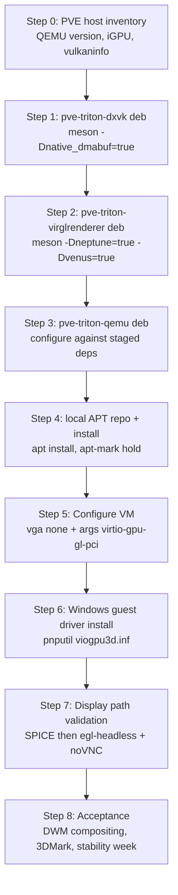

# Porting map: Triton/Neptune stack to Proxmox VE

Companion to [feasibility.md](feasibility.md). This maps the concrete steps to go from "UTM's Triton stack, released for macOS hosts" to "Triton D3D11 acceleration in a Proxmox VE Windows guest on an x86 host with an Intel iGPU".

## 0. What actually needs porting

Less code than it sounds. Neptune was **brought up on a Linux host first** (Ubuntu 24.04, KVM, forked DXVK as the host renderer), and the Triton post ships the Linux build recipes in its appendix. The macOS release added macOS-specific backends (D3DMetal/DXMT, ANGLE-on-Metal, `-display cocoa,gl=es`) on top of a Linux-capable base. So this is primarily a **build-and-integration port**, not a code port — and per project convention, **every host-side component is packaged as a Debian package** rather than installed from a loose prefix:

| Component | Port status for PVE | Deliverable (.deb) | Work involved |
| --- | --- | --- | --- |
| Guest UMD (`neptune_umd.dll`, `osy/virtio-win-mesa`) | **None** | none (Windows guest driver) | Prebuilt, signed, ships in the driver package (MSYS2-built on Windows). Not built on PVE. |
| Guest KMD (`viogpu3d.sys`, `osy/kvm-guest-drivers-windows`) | **None** | none (Windows guest driver) | Same — signed pre-release package. |
| DXVK fork | **Rebuild** | `pve-triton-dxvk` | Native Linux build with dmabuf WSI; recipe published. No code changes expected. |
| virglrenderer (`utmapp/virglrenderer`) | **Rebuild + branch pick** | `pve-triton-virglrenderer` (Depends: dxvk) | `-Dneptune=true -Dvenus=true` Linux build; must confirm the correct branch for the Linux/DXVK backend (Q1 in [next-steps.md](next-steps.md)). |
| QEMU (`proxmox/pve-qemu` + Triton quilt series) | **Rebase** | `pve-triton-qemu` (Conflicts/Replaces: pve-qemu-kvm) | Series rebased onto stock `v11.1.1` (13 of 16 commits kept; see Step 3 rebase ledger); PVE arg compatibility is native by construction. |
| macOS-only components | **Skip** | — | WebKit/ANGLE/libepoxy, d3dmetal-native, dxmt-native, universal `lipo` render server, HVF `ipa-granule-size` — none apply to a Linux host. |
| Integration glue | **New** | `pve-triton-stack` (meta) + wrapper/conffiles | Packaging rules, VM config, environment plumbing (LD_LIBRARY_PATH via package-provided env file), console/display validation. This is the genuinely new work. |

### DKMS applicability (read before assuming it's needed)

**DKMS is not applicable to this stack, and that is a feature, not a gap.** The PVE host needs no out-of-tree kernel modules: the Intel iGPU runs on the in-tree `i915` driver, Vulkan access is userspace (Mesa ANV), and all forked components (QEMU, virglrenderer, DXVK) are pure userspace. DKMS exists for out-of-tree kernel modules (the pattern used by, e.g., vendor GPU drivers on Proxmox); there is no such module here. The Windows-side `viogpu3d.sys` is a guest WDDM driver installed via `pnputil` inside the VM — unrelated to DKMS by definition.

**Commitment:** if a future change ever requires a kernel module (e.g. a custom dmabuf exporter), it must be built via `pve-triton-dkms` following the standard DKMS package layout (`usr/src/<module>-<version>/` + `dkms.conf` + `postinst` calling `dkms install`). Until then, no DKMS package is created.

## 1. Packaging strategy

- **Tooling:** `debhelper` + `meson` build-deps (i.e. `dh` with the meson buildsystem); each component is one source package with a matching binary package name from the table above.
- **Filesystem layout (FHS-clean, dpkg-owned):** binaries in `/usr/lib/pve-triton/{qemu,virglrenderer,dxvk}/`, shared env file in `/etc/pve-triton/env` (exporting `LD_LIBRARY_PATH=/usr/lib/pve-triton/{virglrenderer,dxvk}/lib`), wrapper at `/usr/bin/pve-triton-qemu` (sourcing the env file, then `exec`ing the real binary). No `/opt`, no loose files outside dpkg's database.
- **Versioning:** `<upstream-version>+pve<triton-serial>` (e.g. `9.2.0+pve1`), tracking the base QEMU version so compatibility with PVE's machine types is legible from `dpkg -l`.
- **Coexistence:** **(pivoted 2026-10-08)** `pve-triton-qemu` **replaces** `pve-qemu-kvm` in place (`Conflicts/Replaces:`), because the base *is* PVE's QEMU — the old separate-prefix + wrapper + dispatcher-scheme coexistence created an argument-translation layer whose cost grew to eight rewrites (see the retired shim note in Step 5). The wrapper package still exists for the render-server env plumbing (`/etc/pve-triton/env`), but no longer wraps the QEMU binary.
- **Distribution:** build in a Debian container matching the PVE release, publish to a local APT repo (e.g. `reprepro`/`aptly` served on the PVE host or LAN), then `apt install` + `apt-mark hold pve-triton-*` to survive unattended upgrades. This replaces any manual binary-copy or wrapper-shadowing step.
- **Conffiles:** the wrapper, env file, and example VM config snippet ship as conffiles so local edits survive upgrades.

## 1. Build-order dependency graph



Each step below states the goal, the concrete actions, and the pass criteria. Steps 1–3 each end with a `dpkg-buildpackage` run inside the same Debian container; the .deb artifacts accumulate in the local APT repo installed in Step 4.

## Step 0 — PVE host inventory

Goal: confirm the host can support the Vulkan/dmabuf path before any build time is spent.

```bash
pveversion                                  # record PVE version (8.x / 9.x)
qemu-system-x86_64 --version                # packaged QEMU version; fork must be >= this
lspci -nn | grep -i vga                     # iGPU model (want Gen9/Skylake or newer)
vulkaninfo --summary                        # ANV driver, Vulkan 1.3, device UUID
vulkaninfo | grep -i dma_buf                # VK_EXT_external_memory_dma_buf present?
qm showcmd <test-vmid> --show-opts          # full PVE-generated arg set the fork must accept
```

Pass: ANV reports Vulkan 1.3 + dma_buf ext; save the `qm showcmd` output — it is the compatibility contract for Step 3.

## Step 1 — Package the forked DXVK (host renderer)

Goal: native (non-Wine) DXVK whose WSI exports frames as dmabufs, shipped as the `pve-triton-dxvk` .deb. Upstream recipe from the Neptune post appendix, wrapped in Debian packaging:

```bash
git clone https://github.com/osy/dxvk.git $SRC/dxvk   # branch: master (recon Q7: RESOLVED)
cd $SRC/dxvk
# debian/ uses dh with the meson buildsystem; meson flags via debian/rules override:
#   -Dnative_headless=true -Dnative_sdl2=disabled -Dnative_sdl3=disabled
#   -Dnative_glfw=disabled -Dbuildtype=release -Db_ndebug=true
#   -Dprefix=/usr/lib/pve-triton/dxvk
dpkg-buildpackage -us -uc
```

Notes for the PVE context:
- **Build-recipe correction:** the Neptune post's `-Dnative_dmabuf=true` no longer exists in the current fork — it was replaced by `-Dnative_headless=true` ("headless (no-window) WSI carrier for DXVK Native").
- Outputs are the host backend libraries the Neptune render server `dlopen`s: **`libd3d11.so`** and **`libdxgi.so`** (plus `libvkd3d-proton-d3d12.so` later if D3D12 is wanted). At runtime their locations are overridable via `NPT_D3D11_LIBRARY_PATH` / `NPT_DXGI_LIBRARY_PATH` / `NPT_D3D12_LIBRARY_PATH` — the package's env file can set these explicitly instead of relying on defaults.
- Build in a Debian container matching the PVE release's userspace (Debian 12 for PVE 8, Debian 13 for PVE 9) to avoid glibc/mesa skew; the .deb is built in this container, never on the PVE host.
- No SDL/GLFW needed — the headless WSI needs no window system; no X11/Wayland dev packages required, which keeps the package's dependency set tiny. Good for a headless hypervisor.
- Do *not* register these libraries system-wide (no ldconfig links into `/usr/lib/x86_64-linux-gnu`): they are private to the render server, hence the `/usr/lib/pve-triton/dxvk` prefix.

Pass: `pve-triton-dxvk_<version>.deb` builds; `dpkg -c` shows only the DXVK shared libraries under `/usr/lib/pve-triton/dxvk`; `dpkg -I` shows no runtime deps beyond libc/libstdc++.

> **Verified 2026-10-07 (LXC, Debian 13.1):** plain build succeeds (`ninja`, 337 targets, ~4 min at `-j4`). Two recipe notes: (1) the repo's `include/vulkan` is a **pinned Vulkan-Headers submodule** — run `git submodule update --init --recursive` *before* the first meson setup, and if setup already failed, wipe the build dir and re-run so `-I include/vulkan/include` enters the compile lines (the fork pins Vulkan-Docs 1.4.340; Debian's system headers are too old). (2) The installed lib names are **`libdxvk_d3d11.so` / `libdxvk_dxgi.so`** (under `lib/x86_64-linux-gnu/`) — not `libd3d11.so`/`libdxgi.so`. The render server's `NPT_D3D11_LIBRARY_PATH`/`NPT_DXGI_LIBRARY_PATH` env vars must point at the `libdxvk_*` names. The `.pc` files ship as `dxvk-d3d11.pc`, `dxvk-dxgi.pc`, etc.

## Step 2 — Package virglrenderer with Neptune

Goal: the host component that deserializes Neptune D3D11 calls and drives DXVK, shipped as `pve-triton-virglrenderer` (Depends: `pve-triton-dxvk`). Upstream recipe, unchanged for Linux:

```bash
# branch dev/neptune-linux (recon Q1: RESOLVED — the Linux Neptune branch;
# meson options -Dneptune=true and -Dvenus=true exist in meson_options.txt)
git clone -b dev/neptune-linux https://github.com/utmapp/virglrenderer.git $SRC/virglrenderer
cd $SRC/virglrenderer
# debian/rules meson flags:
#   -Dneptune=true -Dvenus=true -Dtests=false
#   -Dprefix=/usr/lib/pve-triton/virglrenderer
#   (pkg-config finds dxvk via the staged pve-triton-dxvk build or a .pc in the same prefix)
dpkg-buildpackage -us -uc
```

Port-specific differences from the macOS build:
- **No render-server fusion.** The macOS flow builds an x86_64 slice for D3DMetal and `lipo`s it with an arm64 DXMT slice. On Linux there is one native render server (`virgl_render_server`) linking/finding the DXVK libs.
- **Environment discovery is `LD_LIBRARY_PATH`, not `DYLD_FALLBACK_LIBRARY_PATH`**: the render server `dlopen`s the DXVK libraries by plain name, so `/usr/lib/pve-triton/dxvk/lib` must be on `LD_LIBRARY_PATH` at runtime (supplied by the package's env file, Step 4).
- `-Dneptune=true` selects the Neptune backend over Venus inside the server; keep `-Dvenus=true` so the same server also serves guest Vulkan (the Triton KMD registers the Venus ICD too).

Pass: `pve-triton-virglrenderer_<version>.deb` builds and installs; on the PVE host, with the DXVK libs resolving via `NPT_*_LIBRARY_PATH`, `/usr/lib/pve-triton/virglrenderer/libexec/virgl_render_server` starts.

> **Verified 2026-10-07 (LXC, Debian 13.1):** one build fix needed — `src/vrend/vrend_renderer.c` fails under `-Werror=pedantic` (label followed by declaration, GCC 14 strictness). Worked around with `-Dc_args=-Wno-error=pedantic -Dcpp_args=-Wno-error=pedantic`; ship this as a `debian/patches/0001-...` entry rather than editing upstream code. Also: DXVK is a **build-time pkg-config dependency** (`Requires.private: ... dxvk-dxgi` in `virglrenderer.pc`) — the build environment needs `PKG_CONFIG_PATH` to include *both* the virglrenderer and dxvk staging prefixes. Install layout: `libexec/virgl_render_server`, `lib/x86_64-linux-gnu/libvirglrenderer.so.1`, `bin/virgl_test_server`.

## Step 3 — Rebuild pve-qemu-kvm with the Triton series (the pivot)

> **PIVOT (2026-10-08):** the original plan built `utmapp/qemu` (`utm-edition`) and bridged it to PVE with a command-line dispatcher shim. That bridge turned out to be the dominant cost: eight separate rewrites (machine-type pin, `-id`, `-iscsi`, `-cet-*`, `io_uring`, VNC `password=on`, `-accel` append, and — fatally — an efidisk size-hint strip that truncated OVMF var stores and silently discarded every boot option at reset; see the retired shim note in Step 5). The pivot: build **PVE's own QEMU** with the Triton patch series on top, so PVE's command line is the native dialect and the shim disappears entirely.

Goal: `proxmox/pve-qemu` (master = `pve-qemu-kvm 11.1.1-2`) with its `qemu` submodule pinned at stock `v11.1.1`, carrying the Triton series as **quilt patches in `debian/patches/triton/`** — the submodule tree itself stays pristine, exactly like PVE's own `pve/` patch set. Shipped as `pve-triton-qemu`, which **replaces** the stock `pve-qemu-kvm` package rather than coexisting with it (Step 4).

```bash
git clone https://github.com/proxmox/pve-qemu.git $SRC/pve-qemu
cd $SRC/pve-qemu
git submodule update --init --recursive        # ../mirror_qemu @ v11.1.1 (c3d48b7d1e) + roms

cd qemu
git checkout -b triton-picks c3d48b7d1e        # stock v11.1.1
git am -3 /tmp/triton-series/*.patch           # 16 format-patches from utmapp/qemu dev/neptune-linux
cd ..
# debian/changelog: new top entry 11.1.1-2+triton1
# export the picks and append to the quilt series:
git -C qemu format-patch c3d48b7d1e..HEAD -o "$PWD/debian/patches/triton/"
ls debian/patches/triton/ | sed 's|^|triton/|' >> debian/patches/series
apt-get build-dep -y .                         # needs deb-src of the PVE repo in sources
make -j4                                       # Makefile copies qemu/ into the build dir, applies the quilt series, dpkg-buildpackage
```

> **Rebase ledger (2026-10-08, LXC):** of the 16-commit UTM series, **13 were rebased onto v11.1.1**, 2 were **absorbed by upstream 11.1.1 already** (the hostmem-region state machine and async fencing), and 1 was **dropped as macOS-only** (Spice IOSurface/Metal scanout; same bucket as the Metal/ANGLE UI commits that were never in the series). Two upstream changes shaped the merge: console APIs were renamed (`dpy_gl_scanout_dmabuf` → `qemu_console_gl_scanout_dmabuf`), and the unmap path moved from boolean flags to a `mapping_state` machine — the "don't stall the control queue behind a blob unmap" commit was re-grafted onto that machine (deferred `UNREF` completion via `cmd->deferred`, BH-drained `unmap_done_list`, immediate `UNMAP_BLOB` response). One commit from the fork's fix-stream (`retire fences immediately when the renderer context is dead`) is the fix for the exact guest-GPU-scheduler wedge (VIDEO_TDR_FAILURE-class freezes) that motivated this port.

Gotchas for rebuilds (all hit on the LXC):
- **`git -C qemu format-patch -o debian/patches/triton/` writes relative to the submodule** (`-C` chdirs first) — the first run silently created `qemu/debian/patches/triton/`, which then broke the Makefile's `cp -a debian` into the build dir (nested `debian/debian`, `dpkg-buildpackage: cannot open debian/changelog`). Use `-o "$PWD/debian/patches/triton/"` and keep the submodule tree `git status`-clean.
- The Makefile runs `meson subprojects download` only when the submodule looks uninitialized; PVE's `debian/rules` configures with `--disable-download`, so run `meson subprojects download` **inside the build dir** (`pve-qemu-kvm-11.1.1/`) before `dpkg-buildpackage` if the build fails with *"subprojects were not checked out"*.
- Run `dpkg-buildpackage` **from inside the source build dir** (`pve-qemu-kvm-11.1.1/`), not the repo root — a run from the root triggers `debian/rules clean`, which `rm -rf`s the build dir out from under you.
- Never resume a killed build: a killed `dpkg-buildpackage` leaves half-applied quilt state (`.pc/` backups) that poisons the next attempt. `rm -rf` the build dir and recreate via `make pve-qemu-kvm-11.1.1`.
- `dpkg-checkbuilddeps` / `apt-get build-dep .` needs the PVE repo with **`deb-src` + the `pve-no-subscription` component** enabled (Debian 13/trixie sources).

PVE-compatibility checks (now trivial — the base *is* PVE's QEMU):
1. `dpkg -I` version must read `11.1.1-2+triton1` (base-version legible).
2. `qemu-system-x86_64 -device virtio-gpu-gl-pci,help` must list `blob`, `hostmem`, `venus`, `neptune` properties.
3. No dry-run of `qm showcmd` needed — PVE's `-machine type=pc-q35-11.x+pve0`, `-id`, and efidisk0 blockdev JSON are generated for and accepted by this base.
4. The only delta vs stock is the Triton series: `dpkg -L pve-triton-qemu` should match stock `pve-qemu-kvm` file-for-file (plus conffiles).

Pass: `pve-triton-qemu_11.1.1-2+triton1_amd64.deb` builds; a stock PVE VM config (native machine type, efidisk0, and all) starts under the installed binary with the Neptune device attached; **EFI boot options survive a VM reset** (the property the fork's strict efidisk size-hint handling destroyed).

## Step 4 — Local APT repo and host install (pivoted: replace, don't coexist)

Goal: make the Triton stack a first-class, dpkg-managed citizen on the PVE host — installable, upgradable, and trivially revertible — with `pve-triton-qemu` **replacing the stock `pve-qemu-kvm`** (same file paths, `Conflicts/Replaces: pve-qemu-kvm`), which retires the old coexistence scheme (separate prefix + `/usr/bin/pve-triton-qemu` wrapper + `/usr/bin/kvm` dispatcher shim).

1. Collect the .debs from Steps 1–3 into a local APT repo on the PVE host (or LAN host): `aptly` or plain `reprepro` over a small HTTP server; add it as an apt source with the signing key. For a single test node, `apt install ./pve-triton-*.deb` works instead (all package paths on **one** command line — a lone `./pve-triton-stack.deb` cannot resolve its component Depends).
2. Install in dependency order: `apt install pve-triton-dxvk pve-triton-virglrenderer pve-triton-qemu pve-triton-stack`. Installing `pve-triton-qemu` upgrades/replaces `pve-qemu-kvm` in place — same `/usr/bin/kvm`, same machine types, same QMP — so **`qm` lifecycle integration is untouched by construction**.
3. The dxvk/virglrenderer packages still provide the runtime plumbing via `/etc/pve-triton/env` (conffile): `LD_LIBRARY_PATH` for the render server's DXVK/virgl libraries. The QEMU wrapper is gone; the env file is sourced by the render-server launch path.
4. Hold against unattended upgrades: `apt-mark hold pve-triton-dxvk pve-triton-virglrenderer pve-triton-qemu pve-qemu-kvm`; lift the hold only when a rebuild against a new base has passed the Step 3 checks.
5. **Revert path (tested mentally, one command):** `apt install --reinstall pve-qemu-kvm=<stock-version>` (or `apt install pve-qemu-kvm` from the PVE repo after lifting the hold) restores stock QEMU byte-for-byte; the Triton VMs then fail at the `neptune` device property until the package is reinstalled — that is the intended loud failure.
6. Sanity: `dpkg -S /usr/bin/kvm` → `pve-triton-qemu`; `kvm --version` → `11.1.1` base; the Step 3 checks against the installed binary.

Pass: `apt remove pve-triton-qemu && apt install pve-qemu-kvm` cleanly returns the host to stock PVE behavior; VMs without the Neptune device are unaffected either way.

> **DKMS note:** no step in this map produces a kernel module, so there is no DKMS package — see the applicability note in section 0. Add a `pve-triton-dkms` binary package only if the stack ever grows an out-of-tree module.

> **DKMS note:** no step in this map produces a kernel module, so there is no DKMS package — see the applicability note in section 0. Add a `pve-triton-dkms` binary package only if the fork ever grows an out-of-tree module.

> **Verified 2026-10-07 (Debian 13 LXC build host):** all four packages build and install via `packaging/build-all.sh`:
>
> | package | version | size | notes |
> |---|---|---|---|
> | `pve-triton-dxvk` | 2.7.1 | 95M | 337 meson targets, `native_headless` |
> | `pve-triton-virglrenderer` | 1.3.0 | 862K | `neptune=true venus=true`, needs `-Wno-error=pedantic` on GCC 14 |
> | `pve-triton-qemu` | 10.0.12 | 49M | `x86_64-softmmu` only, linked against both staged pkgconfig dirs |
> | `pve-triton-stack` | 0.1 | 2.1K | meta; wrapper + `/etc/pve-triton/env` conffile |
>
> End-to-end check through the installed wrapper (`/usr/bin/pve-triton-qemu`) realizes the Neptune device (TCG smoke test, same as the Step 5 note below). Two packaging gotchas for rebuilds: build with `DEB_BUILD_OPTIONS=noautodbgsym nostrip`, and make the QEMU `debian/rules` `dh_auto_clean` a no-op (the source-root `Makefile` is a configure bootstrap; `make distclean` fails). On the PVE host, replace step 1's repo tooling with `apt install ./pve-triton-*.deb` if a LAN repo is overkill.

> **Verified 2026-10-07 (PVE 9.2.2 test node, i5-8500T, iGPU PCI-passthrough at 01:00.0):** all four packages installed via `apt install ./pve-triton-*.deb` (all four paths must be passed on one command line — a lone `./pve-triton-stack.deb` cannot resolve its component Depends). Post-install checks: stock `pve-qemu-kvm` 11.0.0 binary checksum unchanged, `qm` functional, and the fork realizes the Neptune device through the wrapper with `-accel kvm`. Two host findings:
>
> 1. `/dev/udmabuf` already exists — `CONFIG_UDMABUF` is built into the PVE 9.x kernel (`7.0.2-6-pve`), so the Step 5 `modprobe udmabuf` checklist item is a no-op there.
> 2. **The fork dlopens `libEGL.so.1`/`libGL.so.1` at runtime (via epoxy), which `dh_shlibdeps` cannot see** — `pve-triton-qemu` now carries explicit `Depends: libegl1, libepoxy0, libgbm1, libgl1, libopengl0`. If installing an older build by hand: `apt install libegl1 libepoxy0 libgbm1 libgl1 libopengl0` first (the fresh test node also needed `apt update` — Debian/PVE sources present but unpopulated).
>
> Packages held against unattended upgrades (`apt-mark hold pve-triton-*`).

> **Vulkan host driver (same date):** the render server's DXVK libraries target a host Vulkan ICD — on Intel/AMD hosts that is `mesa-vulkan-drivers` (ANV/RADV); it ships as a `Recommends` of `pve-triton-virglrenderer`, not a hard `Depends`, so an NVIDIA host can substitute the proprietary driver's ICD (keep this pathway open for future NVIDIA GPUs). Verified on the test node with `vulkaninfo --summary`: `Intel(R) UHD Graphics 630 (CFL GT2)`, `PHYSICAL_DEVICE_TYPE_INTEGRATED_GPU`, Vulkan 1.4.305 (`vulkan-tools` is useful for this check but not a runtime dep).

> **Guest-hang root cause (2026-10-08, test node):** with the Neptune device attached, every guest (Windows *and* a Linux live ISO) hung at the firmware stage — black consoles, no serial output, no DHCP, one vCPU pinned at 100%. Not a PVE or Windows bug: the `pve-triton-virglrenderer` package had been built **without EGL/GBM** — `platforms=auto` + `gbm.pc` missing from the build environment at configure time silently degraded the build to GLX-only (`HAVE_EPOXY_EGL_H` undefined in `config.h`). The fork's QEMU then fails the first guest GL command (`virgl could not be initialized: -1` — visible only when running QEMU in the foreground, since PVE daemonizes and discards stderr), never completes the virtio ctrl command, and the firmware spins forever. **Fix:** `pve-triton-virglrenderer` now passes `-Dplatforms=egl` (fails loudly if EGL/GBM is unavailable) and declares `libegl-dev` + `libgbm-dev` in Build-Depends. Debug recipe that found it: run the fork in the foreground with the same args and watch stderr; boot a `virt`-flavor Linux live ISO for serial-console evidence; `screendump <device-id>` per console in the QEMU monitor (`info qtree` to find ids) to see what each display device actually renders.

## Step 5 — VM configuration

Goal: attach the Neptune-capable virtio-gpu device to a Windows VM.

1. Provision the Windows 10/11 x64 VM normally (q35, OVMF, virtio disk/net from the `virtio-win` ISO, guest agent) with the **default display** (`vga: std`) — the guest needs a POST display before drivers exist; `virtio-ramfb-gl` is UTM-only. Since the pivot, provision against the **native machine type** (plain `machine: q35`; PVE resolves the `+pve0` pin itself) and leave `boot: order=` to `qm set` — quote the semicolons: `qm set <vmid> -boot 'order=sata0;sata1;sata2'` (unquoted, the shell splits the command at `;` and only the first device applies).
2. After the OS and drivers are in place, switch:
   ```
   # /etc/pve/qemu-server/<vmid>.conf
   vga: none
   args: -display egl-headless,gl=on -device virtio-gpu-gl-pci,id=triton0,hostmem=4G,blob=true,venus=true,neptune=true
   ```
   Start small on `hostmem` (2–4G); it is reserved on top of `-m` (R5 in the risk register). `egl-headless,gl=on` is the GL display backend the Neptune device requires (PVE's noVNC then renders from the virtio-gpu console).
3. Boot and confirm in the guest: a `1AF4:1050` PCI device appears (Device Manager / `pnputil /enum-devices`).

Pass: device enumerated in the guest; VM still boots to desktop on the fallback display path (or headless, pending Step 7).

> **Machine-type gotcha — OBSOLETE since the pivot (2026-10-08):** this note described pinning `machine: pc-q35-10.0` and lowering `creation-qemu` meta so the *utmapp fork* (base 10.0.12) would start. On the `pve-qemu` base, PVE's resolved machine type (`pc-q35-11.x+pve0`) is native — pin nothing, lower nothing; a plain `machine: q35` is correct.

> **RETIRED — the `/usr/bin/kvm` dispatcher shim (2026-10-07, removed by the Step 3 pivot):** before the pivot, `qm start` under the utmapp fork worked only through a `dpkg-divert` shim (`packaging/pve-triton-stack/kvm-dispatcher.sh`) that routed listed VMIDs to the fork and rewrote eight PVE-only argument groups:
>
> | PVE emission | fork gap | shim rewrite |
> |---|---|---|
> | `type=pc-q35-<ver>+pve0` | no PVE machine patches | `pc-q35-10.0` |
> | `-id <vmid>` | pve-qemu-kvm-only option | stripped |
> | `-iscsi initiator-name=…` | no libiscsi in build | stripped |
> | `-cpu host,-cet-ibt,-cet-ss,…` | no CET props in QEMU 10 host model | `-cet-*` removed |
> | `-vnc …,password=on` | no DES cipher backend | `password=on` removed |
> | `"aio":"io_uring"` | no liburing in build | `"aio":"threads"` |
> | *(no `-accel` arg)* | pve-qemu-kvm defaults to KVM when named `kvm`; fork defaults to TCG | append `-accel kvm` |
> | `"size":131072` in efidisk0 blockdev JSON | fork's pflash backend honors the size hint strictly | strip the size hint |
>
> The table is kept as the cost accounting that justified the pivot: every row was a per-VM argument rewrite living outside dpkg, and the last row was the nasty one — with the hint left in, the fork truncated OVMF's var store to 128K on load, NVRAM became RAM-only, and **every boot option (bcfg entries, Windows' own Boot Manager entry) silently vanished at reset**, costing hours of "vanishing boot entries / UEFI shell after every reboot" ghost-debugging before the size-hint strip was added as yet another shim row. On the native `pve-qemu` base all eight rows disappear by construction: PVE's efidisk0 handling is PVE's own supported code path, and `qm` emits arguments its own QEMU understands. Lesson retained: **when a shim layer starts rewriting the guest-firmware contract, stop shimming and change the base.**

> **Verified 2026-10-07 (LXC, no KVM):** with `-display egl-headless -S -device virtio-gpu-gl-pci,hostmem=256M,blob=true,venus=true,neptune=true`, the device **realizes successfully** through the built virglrenderer (TCG accel; the smoke test ran until killed). One new host requirement surfaced: QEMU logs `warning: open /dev/udmabuf: No such file or directory` — the fork uses the kernel's `udmabuf` helper (`CONFIG_UDMABUF`). It is non-fatal at device-realize time, but **add to the PVE host checklist: `modprobe udmabuf`** (and make it persistent via `/etc/modules-load.d/`); if QEMU runs inside an LXC, the node must also be passed into the container. Runtime impact (fatal vs fallback path) is still unverified — resolve on the PVE node.

> **Windows guest install on the test node (2026-10-08) — five hard-won rules:**
>
> 1. **On q35, never put CDROMs on `ide*` — put all install media on `sata*`.** PVE wires `ide*` to the ICH9 *IDE function*; with any IDE-function CD attached, OVMF fails to produce a BlockIo for the AHCI hard disk (visible via `dh -p BlockIo` in the UEFI shell: only CDROM/VenMedia handles). The first WinPE boot works (Windows' own AHCI driver enumerates the disk), but after setup's first auto-reboot the firmware cannot boot the disk and the VM lands in the UEFI shell — an install that "loses" its disk. With all-SATA media, everything enumerates at every boot.
> 2. **"Press any key to boot from CD"** needs a real keypress on the first boot (~5 s window; HMP `sendkey spc` in a loop from t+8 s works). Later reboots need nothing: the DVD option times out, OVMF falls through to the auto-added `UEFI QEMU HARDDISK` option, and setup continues from disk.
> 3. **`qm rollback` on LVM-thin does not restore disk content** (PVE re-creates the snapshot from the current state; checksums prove the disk matches neither side). Treat PVE snapshots as bookmarks only; verify one before trusting it (activate with `lvchange -ay -K`, `qemu-nbd` mount, checksum a known file, deactivate).
> 4. **Never `qm stop` a VM mid-install** — dirty NTFS → failed-boot counter → WinRE loops that mimic BSODs (no `MEMORY.DMP`, no bugcheck; a `LIVEKERNEL`-style dump is a TDR-class artifact, not a bugcheck). Prefer unattended installs and patience.
> 5. **Unattend gotchas:** `autounattend.xml` on a second CD is read *after* the WinPE language page (drive it with `sendkey alt-n`, the Next mnemonic); `<ProductKey>` belongs inside `<UserData>` or the disk page fails; `FirstLogonCommands` should drive-letter-scan for the bootstrap script (`for %d in (D E F G H I J K) do if exist %d:\npt-setup.ps1 ...`) since the CD's letter depends on enumeration order. For GUI interaction without a console, HMP `sendkey` reaches firmware fine but Windows setup needs either key mnemonics (`alt-n`) or QMP `input-send-event` absolute-pointer clicks (HMP `mouse_move`/`mouse_button` are relative and numeric-only).

## Step 6 — Windows guest driver install

Goal: Triton UMD/KMD bound to the virtio-gpu device.

1. Download the signed pre-release driver package from the `osy/kvm-guest-drivers-windows` GitHub releases; pick the **x64** asset (Q5).
2. Install inside the guest: `pnputil /add-driver viogpu3d.inf /install` (or Device Manager → Update driver on the `1AF4:1050` device).
3. Reboot. The INF registers `neptune_umd.dll` as the D3D UMD and `vulkan_virtio.dll` + `virtio_icd.json` as the Venus ICD — verify both: `dxdiag` should name the Triton/Neptune adapter for D3D11, and `vulkaninfo` should list the Venus ICD.
4. Take a VM snapshot before proceeding — WDDM rollbacks are unreliable, and this is the rescue point (R6).

Pass: `dxdiag` shows D3D11 via the Neptune adapter with no "Microsoft Basic Display Adapter" fallback; no Code 43.

## Step 7 — Display path validation (the highest-risk item)

Goal: prove the scanout path from virtio-gpu blob resources to something a human can watch (R1). Do this in order:

1. **SPICE**: set `display: spice` + `vga: none` in the VM config; connect with the SPICE client. SPICE has the most mature dmabuf/gl path in QEMU.
2. **egl-headless + noVNC**: if SPICE fails, add `args: -display egl-headless,...` (keeping PVE's VNC) so QEMU's VNC backend gets a GL surface for blob scanout.
3. **Fallback**: if neither renders, the QEMU VNC/SPICE backends need a small patch to surface blob scanout — that becomes the first real code change of the port (scope it then; ship it as a commit in the fork's packaging tree, released in the next `pve-triton-qemu` package bump).

Pass: smooth desktop in the guest console. A *smoothly compositing desktop* (DWM) is itself evidence the shared-texture/fence paths work, since DWM renders every frame through the Neptune stack.

## Step 8 — Acceptance

1. 3DMark Fire Strike completes; score recorded (Neptune post benchmarks are the reference point: Neptune host-side DXVK ≈ Venus performance).
2. One light D3D11 game or demo runs stable for 30+ minutes.
3. `virgl_render_server` worker processes observed on the host with DXVK loaded (one per guest render context); no host memory growth over days.
4. Normal PVE lifecycle works on the VM: `qm stop`/`start`, snapshot, backup, and cross-node migration — migration is supported once the second node also has the local APT repo and `pve-triton-*` packages installed at the same version (the `+pve` version suffix makes the requirement auditable via `dpkg -l`); until then, keep migration off.
5. Leave it running a week before declaring the port viable.

## Where the port could stall, in order

1. **Step 2** — wrong virglrenderer branch (macOS-only backend); resolve Q1 first.
2. **Step 3** — a Triton patch regressed against a newer PVE base; re-run the rebase ledger below.
3. **Step 7** — display scanout needs a QEMU patch; this is the only step where original code is likely to be written.

## Appendix — Triton series provenance (utmapp/qemu `dev/neptune-linux` → `pve-qemu` quilt)

The rebased series lives in `debian/patches/triton/` (13 patches) of the `pve-triton-qemu` source package. The `qemu` submodule stays pristine; all porting knowledge is in the quilt layer. Of the 16 UTM commits the series was cut from, **13 were rebased, 2 were already absorbed by upstream QEMU 11.1.1, and 1 was dropped as macOS-only** (in addition to four earlier UTM UI commits — Metal/ANGLE cleanup `e03f5c90d1`, console rename `3efe3a5992`, native device `f9b62e0ee7`, Metal scanout `123780d896` — which were never selected because their Linux value is zero and their API base is the fork's renamed console layer).

| # | utmapp commit | subject | disposition in `pve-qemu` series |
|---|---|---|---|
| 1 | `435e2fc057` | virtio-gpu: Support Neptune context | `triton/0001` — capsets/device property conflicts resolved keeping both upstream and fork paths |
| 2 | `d8a30b7576` | virtio-gpu: support context init multiple timeline | `triton/0002` — upstream error handling kept; fork's timeline argument to `create_fence` |
| 3 | `b64cf290f7` | virtio-gpu-virgl: add support for native blob scanout | `triton/0003` — applied clean |
| 4 | `650063be4a` | virtio-gpu-virgl: Add virtio-gpu-virgl-hostmem-region type | **absorbed** — upstream 11.1.1's `mapping_state` machine supersedes the fork's boolean state |
| 5 | `c4fc99c8b4` | virtio-gpu: keep suspended fenced commands at the cmdq head | `triton/0004` |
| 6 | `a6a16d8dde` | virtio-gpu-virgl: tear down hostmem region in resource_destroy | `triton/0005` — folded with the virglrenderer-version-define conflict resolutions |
| 7 | `410460413d` | virtio-gpu/udmabuf: make flip-chain re-presents cheap | `triton/0006` — renamed to upstream console API (`qemu_console_gl_scanout_dmabuf`), fork's conditional-resize logic kept |
| 8 | `10cd9e21d8` | virtio-gpu-virgl: bound the scanout-blob rect | **absorbed** — upstream refactored the same check into `virtio_gpu_check_scanout_bounds` |
| 9 | `a0f453befd` | virtio-gpu: retire fences immediately when the renderer context is dead | `triton/0007` — the guest-GPU-scheduler-wedge fix (VIDEO_TDR_FAILURE class); merged into upstream's logging style |
| 10 | `881e5ff38f` | virtio-gpu-virgl: bound render-server fence-notify latency to 1ms | `triton/0008` |
| 11 | `2870e745b9` | virtio-gpu: Support asynchronous fencing | `triton/0009` — committed but **functionally absorbed**: upstream 11.1.1 already carries `async_fenceq`/`reset_async_fences` |
| 12 | `3824e0d996` | virtio-gpu: enable async fencing on the render-server path without EGL | `triton/0010` — the render-server-critical one; `async_fence_enabled` merged with upstream's hostmem fields |
| 13 | `3bdba2ae2e` | virtio-gpu: don't stall the control queue behind a blob unmap | `triton/0011` — **re-grafted onto upstream's `mapping_state` machine**: deferred UNREF completion (`cmd->deferred`), BH-drained `unmap_done_list`, immediate UNMAP_BLOB response; also repaired the duplicated `resource_destroy` left by the rebase |
| 14 | `757606845f` | virtio-gpu: let a create wait for a deferred unref of the same id | `triton/0012` |
| 15 | `7c3a9a0e52` | virtio-gpu-gl: initialise the deferred flag on every popped command | `triton/0013` |
| 16 | `263d9536fa` | spice-display: avoid sending duplicate scanout | **dropped** — CONFIG_IOSURFACE/CONFIG_METAL macOS-only paths, no Linux build value |
